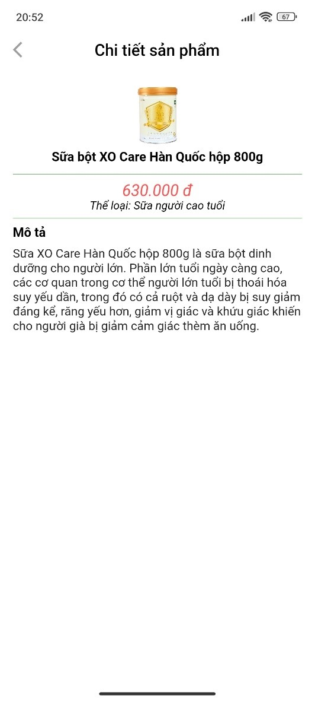
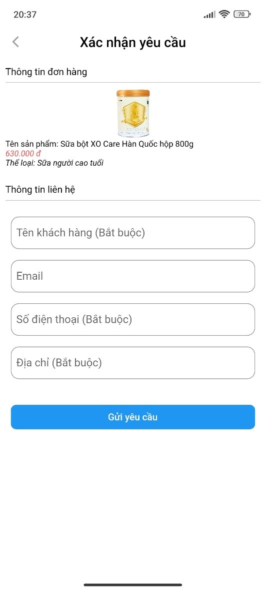
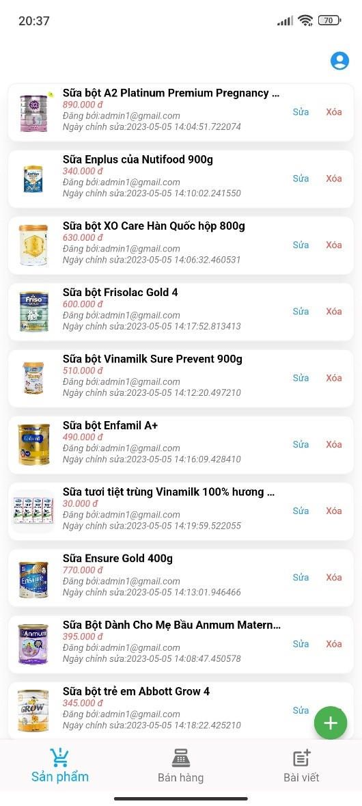
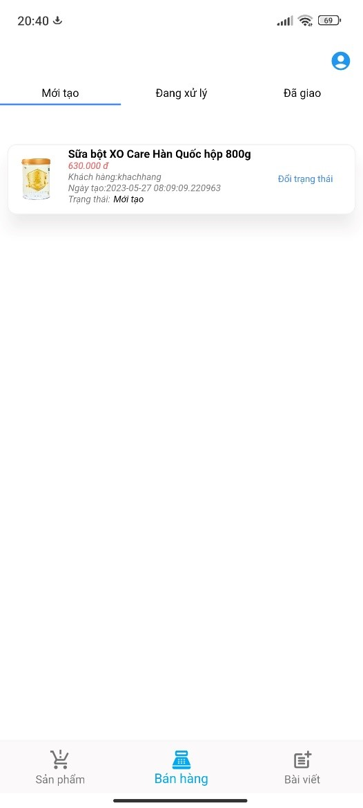

# ỨNG DỤNG BÁN SỮA ONLINE
## Giới thiệu phần mềm
### * Chức năng cho khách hàng:
#### - **Đăng ký:** Cho phép khách hàng đăng ký tài khoản để đăng nhập vào ứng dụng, giúp khách hàng có thể mua hàng trên ứng dụng.
#### - **Đăng nhập:** Khách hàng cần đăng nhập để có thể thực hiện các chức năng mua hàng, nếu chưa có tài khoản, khách hàng có thể đăng ký tài khoản.
#### - **Mua hàng:** Khách hàng sẽ chọn sản phẩm mà mình sẽ mua (có trong danh sách các mặt hàng có bán torng ứng dụng), cho vào giỏ hàng. Khách hàng cần điền các thông tin cần thiết trước khi đặt hàng.
#### - **Xem thông tin sản phẩm:** Chức năng cho phép khách hàng có thể xem thông tin như tên sản phẩm, giá cả của sản phẩm, hình ảnh sản phầm và mô tả về sản phẩm được hiển thị trên ứng dụng.
#### - **Thêm vào giỏ hàng:** Khách hàng có thể xem thông tin đơn hàng trong giỏ hàng, kiểm tra những sản phẩm đã chọn trong giỏ hàng, điều chỉnh số lượng sản phẩm trước khi đặt hàng.
#### - **Thanh toán:** Khách hàng thanh toán sau khi đặt hàng, có thể thanh toán trực tuyến bằng hình thức chuyển khoản hoặc thanh toán trực tiếp sau khi nhận hàng.
#### - **Xem bài viết:** Chức năng giúp khách hàng có thể xem các bài viết do các khách hàng khác đánh giá nhận xét các sản phẩm có bán trong ứng dụng.
#### - **Đăng bài viết:** Khách hàng có thể nhận xét hoặc đánh giá sản phẩm mà mình đã mua.
### * Chức năng cho Admin:
#### - **Đăng nhập:** Admin phải đăng nhập với tài khoản admin để thức hiện các chức năng của admin.
#### - **Quản lý tài khoản:** Admin có thể sửa hoặc xóa tài khoản của khách hàng khi cần thiết.
#### - **Quản lý đơn hàng:** Admin sẽ là người quản lý các đơn hàng của khách hàng đã đặt, xem chi tiết, xử lý đơn hàng đã thanh toán và sửa hoặc xóa đơn hàng.
#### - **Quản lý sản phẩm:** Admin có thể thêm sửa xóa các thông tin của sản phẩm được bán trong ứng dụng.

## Xây dựng phần mềm
#### Công nghệ lập trình: Flutter
#### Công cụ lập trình: Android Studio
#### Cơ sở dữ liệu: MySQL
#### Ngôn ngữ lập trình: Dart
## Minh họa các chức năng
### Trang chủ

### Chi tiết sản phẩm

### Mua hàng

### Quản lý sản phẩm - Admin

### Quản lý đơn hàng - Admin

